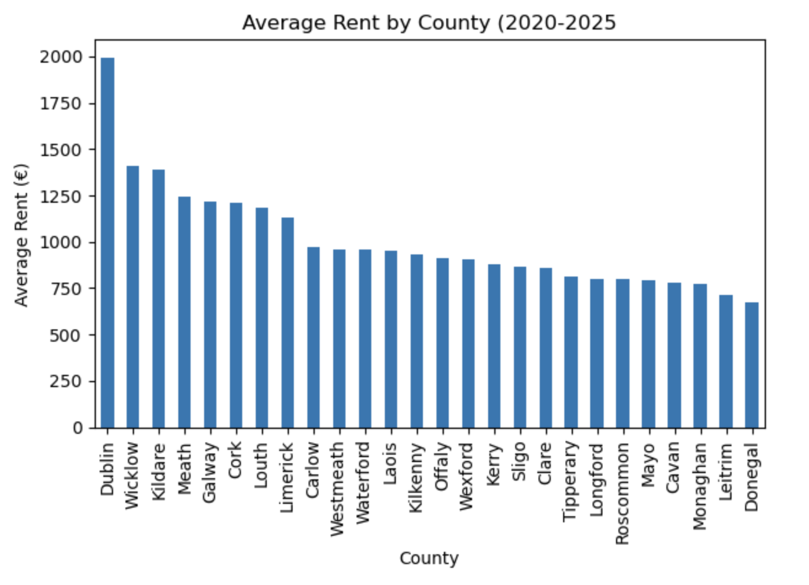
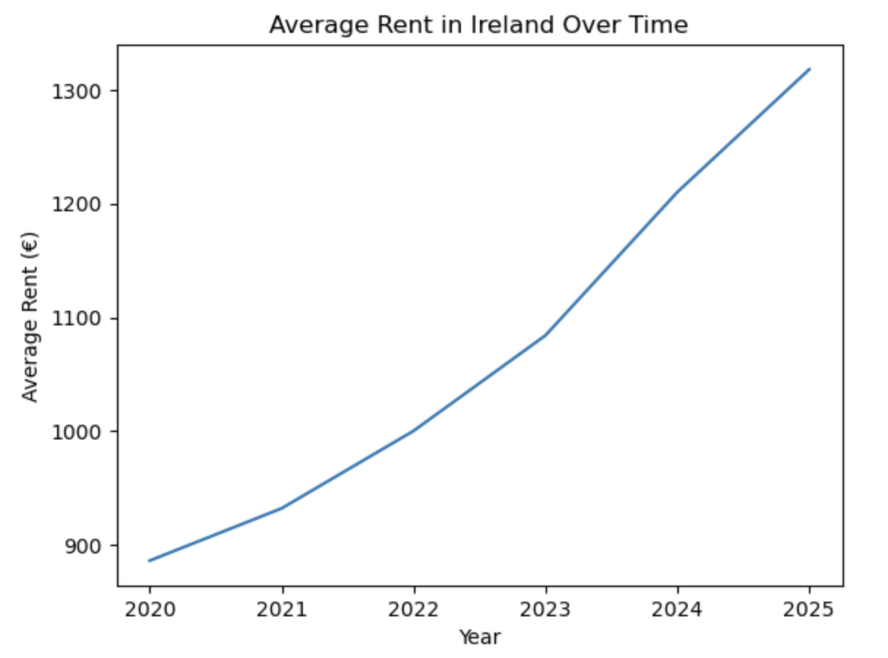
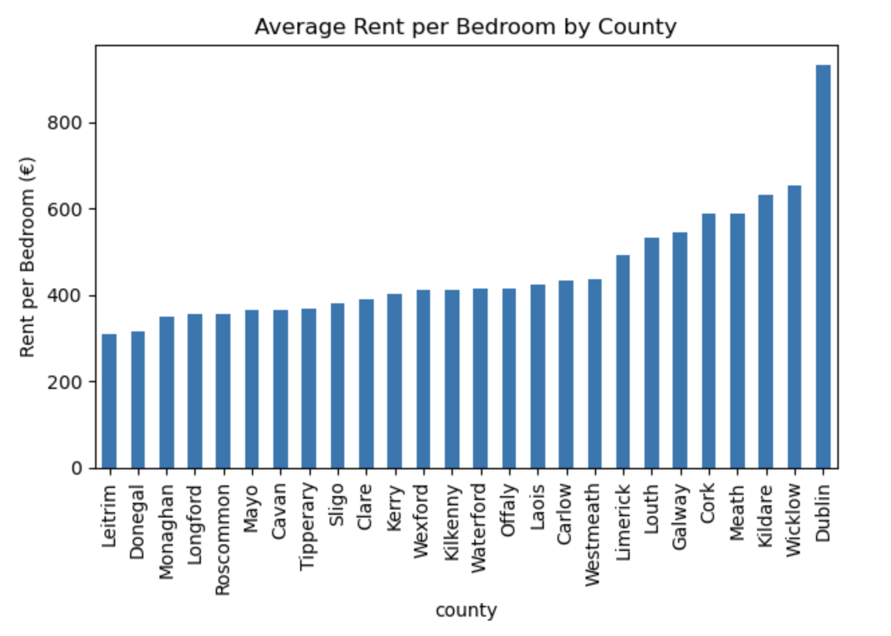

# 🇮🇪 Ireland First Rent Guide (2020–2025)

## 📌 Project Overview

This project analyzes official Irish rental data (RTB) from 2020 to 2025 to provide practical insights for individuals looking to rent a property in Ireland.

The objective is to transform raw rental data into a data-driven guide that helps prospective tenants understand:

- Regional rental differences  
- Rental price evolution over time  
- Affordability by county  
- Value for money per bedroom  

This project was developed as part of my transition into Data Analytics and demonstrates end-to-end data analysis skills using Python.

---

## 📊 Dataset

**Source:** RTB (Residential Tenancies Board) Official Rental Data, Kaggle  
**Period Covered:** 2020 – 2025  
**Granularity:** County-level aggregates  

The dataset includes:

- Rental price (€)
- County
- Province
- Property type
- Number of bedrooms
- Time period (year & half-year)

---

## 🛠 Tools & Technologies

- Python  
- Pandas (Data Cleaning & Aggregation)  
- Matplotlib (Data Visualization)  
- Jupyter Notebook  

---

## 🧹 Data Preparation

Key cleaning and transformation steps:

- Filtered dataset to county-level aggregates to avoid duplication.
- Simplified property types into two main categories: **Apartment** and **House**.
- Created additional analytical features such as:
  - Rent per bedroom
- Grouped and aggregated data by county and year.
- Calculated averages and growth trends over time.

---

## 🔍 Business Questions

1. What is the average rental cost by county?
2. Which counties are the most affordable?
3. How have rental prices evolved from 2020 to 2025?
4. Is Dublin significantly more expensive than other counties?
5. Which areas offer the best value for money per bedroom?

---

## 📈 Key Findings

### 1️⃣ Dublin Dominates the Market

Dublin remains significantly more expensive than any other county, reflecting strong demand and supply pressure in the capital region.

---

### 2️⃣ Rental Prices Increased Consistently (2020–2025)

Rental prices show a steady upward trend across the entire country, with noticeable acceleration after 2022.

---

### 3️⃣ Strong Regional Disparities

Western counties such as Donegal and Leitrim offer substantially lower rental costs compared to the Dublin metropolitan region.

---

### 4️⃣ Value for Money Differs by Region

When analyzing rent per bedroom, western counties provide significantly better value compared to Dublin and surrounding counties.

---

## 📌 Conclusions

- Dublin remains the most expensive rental market in Ireland.
- Rental prices increased consistently between 2020 and 2025.
- Regional inequalities in housing affordability persist.
- Smaller counties offer better value per bedroom, though they are also experiencing growth.

This analysis provides a practical, data-driven overview for individuals considering renting in Ireland.

---

## 🚀 Future Improvements

- Include inflation-adjusted rent analysis
- Add interactive dashboards (Plotly or Tableau)
- Incorporate salary comparison to evaluate affordability ratios
- Perform time-series forecasting
